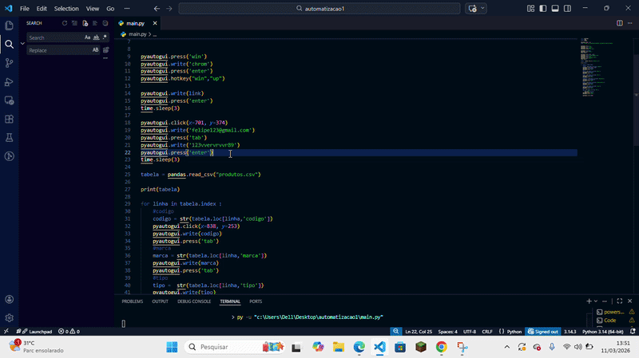

# Automação de Cadastro de Produtos com Python
Este projeto é uma automação desenvolvida em **Python** que realiza o cadastro automático de produtos em um sistema web utilizando **PyAutoGUI** e dados de uma planilha CSV.
A automação abre o navegador, acessa um site, realiza login e preenche automaticamente os campos de cadastro com base nas informações da planilha.

##  Demonstração

## Funcionalidades
- Abertura automática do navegador
- Acesso automático ao site
- Login automatizado
- Leitura de dados de uma planilha CSV
- Preenchimento automático de formulários
- Cadastro sequencial de produtos
- Scroll automático da página

## Tecnologias utilizadas
- Python
- PyAutoGUI
- Pandas

## Como executar
1. Instale as dependências
pip install -r requirements.txt

2. Execute o script
python main.py
